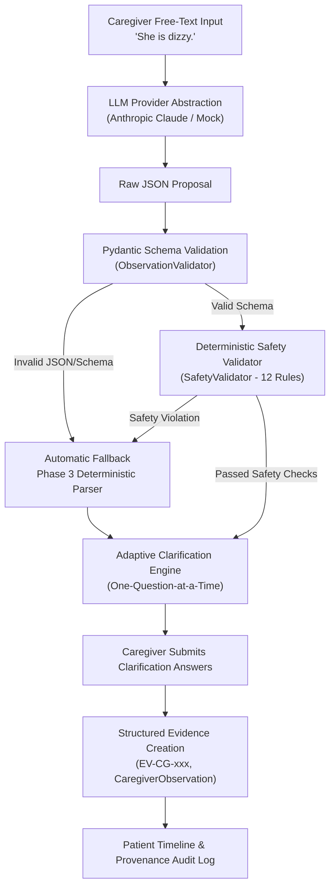

# EvoCare Phase 4: LLM-Powered Observation Extraction & Intelligent Clarification Architecture

> **Foundational Principle:**
> *"The LLM is an interpretation layer, not a source of clinical truth."*
> In EvoCare, the LLM functions strictly as a **Proposer**, the backend code acts as the **Validator**, and the database is the **Source of Stored Facts**.

---

## 1. Executive Overview

Caregivers routinely submit free-text observations containing critical clinical signals (e.g., *"She is dizzy"*, *"She almost fell near the bathroom"*, *"She didn't eat much at dinner"*). However, free-text descriptions are frequently ambiguous, missing critical parameters (severity, duration, onset), or phrased with subjective uncertainty.

Phase 4 introduces an LLM-assisted interpretation layer designed to:
1. Interpret natural-language caregiver statements without modifying clinical records.
2. Extract standardized structured parameters into controlled Pydantic schemas.
3. Detect uncertainty and linguistic nuances (e.g., *"I think she took her medicine"* $\rightarrow$ `UNCERTAIN`).
4. Identify missing parameters and drive adaptive, sequential clarification.
5. Provide automatic, 100% reliable fallback to Phase 3 deterministic parsing when the LLM is unavailable or rejects output on safety bounds.



---

## 2. Architectural Components

### A. Provider Abstraction Layer (`app/services/llm/`)

```
app/services/llm/
    ├── __init__.py           # Package exports
    ├── provider.py           # Abstract LLMProvider base class & MockLLMProvider
    ├── anthropic_provider.py # Concrete Anthropic Claude API provider with safe try/except
    ├── schemas.py            # Pydantic schemas (ParsedCaregiverObservation, Enums)
    ├── prompts.py            # System prompts & minimal-context extraction templates
    ├── validator.py          # ObservationValidator (JSON syntax & Pydantic schema validation)
    └── safety_validator.py   # SafetyValidator (12 deterministic safety rules)
```

The application interacts solely with the abstract `LLMProvider` interface:
```python
class LLMProvider(ABC):
    @abstractmethod
    def extract_observation(self, text: str, patient_context: Optional[Dict[str, Any]] = None) -> LLMResult:
        pass
```
No router or database service directly depends on vendor-specific SDK classes, ensuring provider interchangeability.

---

## 3. Strict Pydantic Output Schema (`schemas.py`)

All LLM output must strictly conform to `ParsedCaregiverObservation`:

| Field | Type | Description |
| :--- | :--- | :--- |
| `category` | `ObservationCategory` (Enum) | Controlled domain (`mobility`, `fall`, `near_fall`, `dizziness`, `nutrition`, `cognition`, `sleep`, `pain`, `behavior`, `medication_adherence`, `activity`, `other`) |
| `event_type` | `Optional[str]` | Granular event classification (`NEAR_FALL`, `FALL`, `NO_FALL`, etc.) |
| `severity` | `str` | Explicitly stated severity or `"UNKNOWN"` |
| `duration` | `str` | Explicitly stated duration or `"UNKNOWN"` |
| `frequency` | `str` | Explicitly stated frequency or `"UNKNOWN"` |
| `onset` | `str` | Explicitly stated temporal trigger or `"UNKNOWN"` |
| `context` | `str` | Stated setting/location or `"UNKNOWN"` |
| `confidence` | `ConfidenceLevel` (Enum) | `HIGH`, `MEDIUM`, `LOW`, `UNCERTAIN` |
| `certainty` | `CertaintyState` (Enum) | `CONFIRMED`, `UNCERTAIN`, `SUSPECTED`, `DENIED` |
| `etiology` | `str` | **MUST be `"UNKNOWN"`**. Never infer medical causes. |
| `diagnosis` | `Optional[str]` | **MUST be `None`**. LLM cannot diagnose. |
| `dementia_diagnosed` | `bool` | **MUST be `False`**. |
| `clinical_diagnoses_inferred` | `bool` | **MUST be `False`**. |
| `ground_impact` | `Optional[bool]` | `False` for near-falls, `True` for completed falls |

---

## 4. Deterministic Safety Rules (`safety_validator.py`)

The backend deterministically executes the following rules after every LLM proposal:

1. **RULE 1 (Near-Fall Invariant):** `NEAR_FALL` cannot become `FALL`. "She almost fell" must have `category: near_fall`, `event_type: NEAR_FALL`, and `ground_impact: false`. Negated falls ("did not fall") must never be classified as `FALL`.
2. **RULE 2 (Cognition Invariant):** Caregiver confusion cannot become dementia. `dementia_diagnosed` must be `False` and `diagnosis` cannot contain dementia or Alzheimer's.
3. **RULE 3 (Dizziness Etiology Invariant):** Dizziness cannot receive inferred etiology (e.g. stroke, dehydration, vertigo, hypotension). `etiology` must remain `"UNKNOWN"`.
4. **RULE 4 (Absolute Unknown - Severity):** Missing severity remains `"UNKNOWN"`. The LLM cannot invent "Severe" if the caregiver did not write it.
5. **RULE 5 (Absolute Unknown - Duration):** Missing duration remains `"UNKNOWN"`.
6. **RULE 6 (Absolute Unknown - Onset):** Missing onset remains `"UNKNOWN"`.
7. **RULE 7 (Absolute Unknown - Frequency):** Missing frequency remains `"UNKNOWN"`.
8. **RULE 8 (Clinical Separation):** LLM cannot modify diagnosis records.
9. **RULE 9 (Medication Separation):** LLM cannot modify medication regimens.
10. **RULE 10 (Lab Separation):** LLM cannot modify laboratory records.
11. **RULE 11 (Doctor Record Separation):** LLM cannot modify physician assessments.
12. **RULE 12 (Immutability):** LLM cannot overwrite immutable evidence.

---

## 5. Fallback Mechanism & Resilience

If any of the following occur:
- `ANTHROPIC_API_KEY` is missing or empty
- `LLM_ENABLED` is set to `false`
- Network timeout or API error occurs
- LLM emits malformed or unparseable JSON
- Pydantic schema validation fails
- SafetyValidator flags a safety rule violation

The system **automatically falls back** to the Phase 3 deterministic rule-based parser without failing the API request or dropping the caregiver's submission. The response indicates `processing_method: "LLM_FALLBACK"`.

---

## 6. Clarification Workflow & Redundant Question Prevention

1. **One-Question-at-a-Time (`next_question`):** Rather than overwhelming caregivers with all missing fields at once, the API prioritizes the highest-urgency missing field and presents it as `next_question`.
2. **Redundant Question Prevention:** If the caregiver already stated parameters in the initial text (e.g., *"She had severe dizziness for about 10 minutes after getting out of bed"*), the parser extracts `severity="Severe"`, `duration="approximately 10 minutes"`, `onset="after getting out of bed"`, and omits those questions from `missing_fields`.

---

## 7. Evidence Provenance & Audit Logging

When clarification completes and evidence is persisted:
- **`Evidence` Table:** Creates an immutable record (`EV-CG-xxx`) storing the exact `original_statement` and source ID.
- **`CaregiverObservation` Table:** Stores structured attributes with explicit provenance tags (`extraction_method: "LLM_ASSISTED"` or `"LLM_FALLBACK"` or `"DETERMINISTIC"`), `certainty`, and `confidence`.
- **`AuditLog` Table:** Creates an audit entry recording the extraction method and session code without leaking API keys or secrets.

---

## 8. Configuration

Configured via environment variables in `app/core/config.py`:
```env
ANTHROPIC_API_KEY=your_api_key_here
ANTHROPIC_MODEL=claude-3-5-sonnet-20241022
LLM_ENABLED=true
```
If `ANTHROPIC_API_KEY` is omitted, the system runs safely in offline mode with deterministic fallback.

---

## 9. Limitations & Strict Boundaries

- **No Medical Reasoning:** The LLM does not perform clinical diagnosis, triage scoring, or drug interaction evaluation.
- **No Direct Memory Mutation:** The LLM cannot directly modify the Patient Wiki or historical evidence.
- **Proposer Only:** Every LLM proposal is gated behind schema validation, safety rules, and caregiver confirmation.
