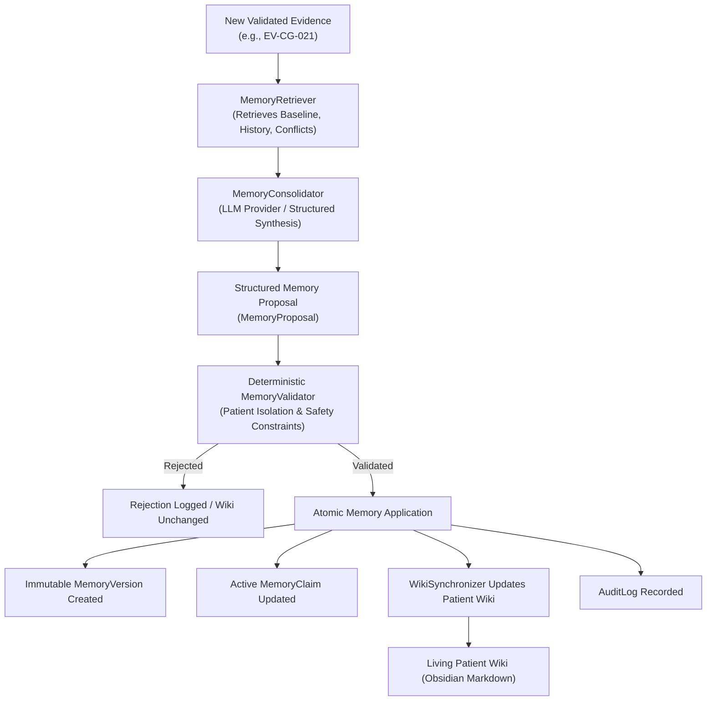

# EvoCare Phase 5: Evolving Memory & Living Patient Wiki Architecture

> **Core System Axiom:**
> *"LLM interprets. Rules constrain. Evidence proves. Memory evolves. Doctor decides."*

---

## 1. Executive Overview

EvoCare evolves from an observation repository into a **Living Longitudinal Patient Memory System**. When new clinical or caregiver evidence is validated, the system synthesizes historical context, generates structured memory proposals, applies deterministic safety checks, commits versioned memory records, and updates human-readable Patient Wiki markdown documents with full provenance.

---

## 2. Three-Layer Architecture

| Layer | Responsibility | Mutability | Example |
| :--- | :--- | :--- | :--- |
| **1. Immutable Evidence** | Raw observations, doctor records, lab reports, and transcripts. | **IMMUTABLE** | `EV-CG-021`: *"She needed someone's arm while walking outside."* |
| **2. Versioned DB Memory** | System's synthesized longitudinal understanding over time. | **VERSIONED** | `Version 4`: *"Recent caregiver observations describe intermittent need for support outdoors."* |
| **3. Living Patient Wiki** | Human-readable Markdown representation with citations. | **SYNCHRONIZED** | `Patient Wiki/P001 Meenakshi Raman/Caregiver/Mobility.md` |

---

## 3. Detailed Component Architecture

### A. Memory Retrieval (`app/services/memory/retriever.py`)
- **Patient Isolation:** Enforces `evidence.patient_id == patient_id`. Cross-patient requests are immediately rejected.
- **Context Scoping:** Gathers baseline parameters, relevant clinical physician records, recent caregiver observations within related domains, active memory claims, and documented conflicts.

### B. Memory Consolidation (`app/services/memory/consolidator.py`)
- Reuses Phase 4 `LLMProvider` abstraction.
- Enforces strict memory consolidation prompt rules:
  1. Grounded strictly in supplied evidence.
  2. No clinical diagnoses fabricated.
  3. No clinical causes/etiologies inferred.
  4. Never erase historical baseline or previous observations.
  5. Preserve temporal sequence and evolution.
  6. Preserve conflicting viewpoints without taking sides.
  7. Mandatory citation of Evidence IDs.
  8. If no new information is present, emit `NO_CHANGE`.

### C. Deterministic Memory Validation (`app/services/memory/validator.py`)
- Validates patient existence and isolation.
- Verifies every cited `evidence_ids` code exists in the database for that patient.
- Blocks unconfirmed clinical diagnoses (dementia, Alzheimer's, stroke, vertigo, dehydration, anemia, hypotension).
- Blocks upgrading `NEAR_FALL` into `FALL`.
- Prohibits memory updates from altering authoritative physician assessments, medications, or lab panels.

### D. Memory Versioning & Claims (`app/models/memory_models.py`)
- **`MemoryVersion`:** Immutable log of every accepted memory delta with sequence tracking (`version_number`, `previous_version_id`, `change_summary`, `validation_status`).
- **`MemoryClaim`:** Active, queryable atomic claims linked to supporting evidence.
- **`MemoryProposal`:** State machine managing proposal lifecycles (`CREATED` $\rightarrow$ `VALIDATED` $\rightarrow$ `APPLIED` or `REJECTED`).

### E. Wiki Synchronization (`app/services/memory/wiki_sync.py`)
- Resolves domain category to target Wiki page (e.g. `mobility` $\rightarrow$ `Caregiver/Mobility.md`).
- Preserves all existing page structure, baseline definitions, and prior history.
- Appends new versioned longitudinal memory entries with clickable evidence references (`[[Raw Evidence/Caregiver/EV-CG-xxx|EV-CG-xxx]]`).
- Updates `Memory Version History` banner with version number, previous version, and timestamp.
- **Atomicity:** If file writing fails, the database transaction is rolled back.

---

## 4. Source Separation & Conflict Preservation

The system explicitly distinguishes:
- **Clinician-Confirmed Documentation:** Historical baseline and physician assessments.
- **Caregiver-Reported Observations:** Day-to-day functional variations and support needs.
- **Conflicting / Contextual Information:** When clinical documentation and caregiver observations differ (e.g. physician records independent mobility on 2026-08-18 while caregiver notes assistance needed on 2026-09-02), both are preserved with contextual timestamps rather than declaring one source erroneous.

---

## 5. REST API Endpoints

| Method | Endpoint | Description |
| :--- | :--- | :--- |
| `POST` | `/api/memory/consolidate` | Generates and validates a structured memory proposal. |
| `POST` | `/api/memory/apply/{proposal_id}` | Atomically applies a validated proposal, writes `MemoryVersion`, and updates Wiki. |
| `GET` | `/api/memory/proposals/{proposal_id}` | Retrieves proposal details and validation status. |
| `GET` | `/api/memory/{patient_id}/{page}` | Returns active claims and current memory version for a domain page. |
| `GET` | `/api/memory/{patient_id}/{page}/history` | Returns chronological version history for a domain page. |
| `GET` | `/api/memory/{patient_id}/{page}/diff` | Returns delta (added claims, preserved baseline) between current and previous versions. |
| `GET` | `/api/memory/{patient_id}/summary` | Returns comprehensive longitudinal patient memory summary. |

---

## 6. Example Evolution: Mobility Domain

1. **Initial Baseline (Version 1):**
   - *Baseline:* Independently mobile without assistive aids.
2. **First Caregiver Event (Version 2):**
   - *Evidence:* `EV-CG-021` (*"She needed someone's arm while walking outside."*)
   - *Evolved Memory:* *"Recent caregiver observations describe intermittent increased need for walking support outdoors while preserving historical independent ambulation baseline."*
3. **Second Caregiver Event (Version 3):**
   - *Evidence:* `EV-CG-040` (*"She was walking better today and did not need support inside the house."*)
   - *Evolved Memory:* *"Historically independent baseline, with recent intermittent support needed outdoors, followed by subsequent recovery in indoor unassisted walking."*
4. **Historical Preservation:** All versions, timestamps, and citations remain permanently recoverable.
