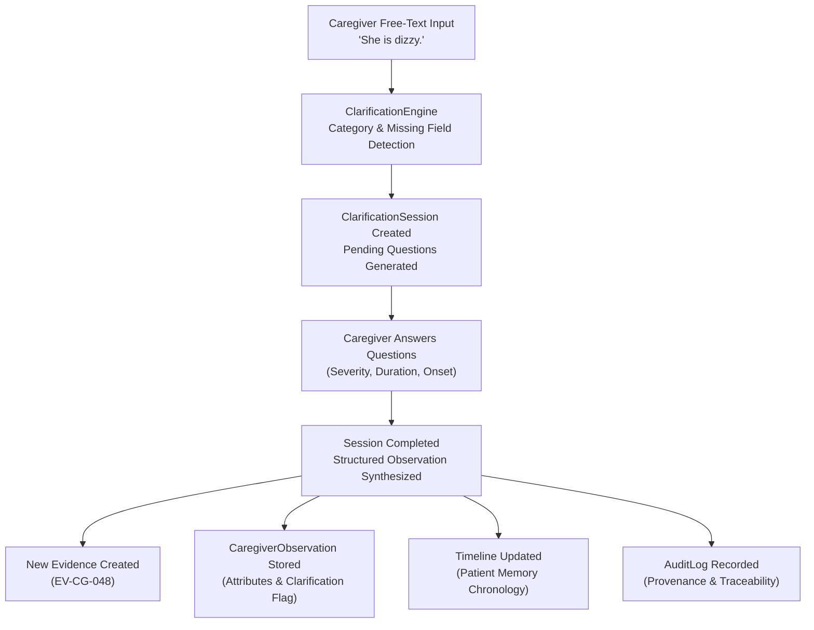

# EvoCare Phase 3 Validation Report: Caregiver Observation Intelligence Pipeline

**Timestamp:** 2026-09-10  
**Phase:** Phase 3 — Caregiver Observation Intelligence Pipeline (Adaptive Clarification & Structured Ingestion)  
**Status:** **PASSED & VERIFIED (100%)**

---

## 1. Executive Summary

Phase 3 introduces the **Caregiver Observation Intelligence Pipeline** to EvoCare. It transforms ambiguous, unstructured free-text caregiver notes into clinically actionable, structured evidence through an interactive clarification workflow without performing unauthorized medical reasoning or hallucinating diagnoses.

### Key Metrics
- **Supported Observation Categories:** 10 categories (`mobility`, `fall`, `near_fall`, `dizziness`, `nutrition`, `cognition`, `sleep`, `pain`, `behavior`, `medication_adherence`)
- **New Database Tables:** 3 models (`clarification_sessions`, `clarification_questions`, `clarification_answers`)
- **New Endpoints Created & Verified:** 5 endpoints (`POST /api/observations/start`, `GET /api/clarification/{session_id}`, `POST /api/clarification/{session_id}/answer`, `POST /api/clarification/{session_id}/complete`, `GET /api/observations/{observation_id}`)
- **Total Automated Tests:** 60 tests passing (27 new Phase 3 tests + 33 Phase 1/Phase 2 regression tests)
- **Phase 1 / Phase 2 Immutability:** 100% preserved (all 65 initial evidence records, 47 caregiver observations, 5 doctor records untouched).

---

## 2. End-to-End Observation Pipeline Flow



---

## 3. Detailed Verification Breakdown

### A. Clarification Sessions & Question Generation
- **Category Detection:** Heuristics and regex token analysis accurately identify all 10 domain categories.
- **Missing Field Detection:** Extracts initial mentions from text (e.g. "mildly dizzy after getting up" extracts severity and onset) and prompts only for truly missing required fields.
- **Multiple-Choice Options:** Every question includes at least 2 distinct multiple choice options plus uncertainty fallbacks (`Not sure`, `Unknown`).

### B. Answer Storage & State Machine
- **Session Lifecycles:** Tracks state transition `PENDING -> IN_PROGRESS -> COMPLETED`.
- **Answering Mechanism:** Supports answering by `question_id` or directly by `field_name`.
- **State Protection:** Reject answers or duplicate completion calls on already completed sessions with HTTP 400.

### C. Structured Observation & Evidence Generation
- **Structured Schema:** Emits structured JSON containing category, raw statement, confirmed attributes, and explicit safety metadata (`clinical_diagnoses_inferred: false`).
- **Sequential Evidence Code Generation:** Dynamically assigns sequential `EV-CG-xxx` codes (e.g., `EV-CG-048`, `EV-CG-049`) linking back to caregiver source IDs.
- **Timeline Integration:** Completing a clarification session immediately creates a timeline event reflecting the new evidence in chronological patient memory.
- **Audit Logging:** Logs observation creation events with action `OBSERVATION_CLARIFIED_AND_INGESTED`.

---

## 4. Safety & Clinical Invariant Verification

| Safety Rule | Verification Mechanism | Test Status |
| :--- | :--- | :--- |
| **No Dementia Diagnosis** | Free-text confusion (e.g., "She seems confused") generates clarification for description/duration and explicitly sets `dementia_diagnosed: false`. | **VERIFIED** |
| **No Dizziness Cause Hallucination** | Dizziness observations set `etiology: "UNKNOWN (Requires Clinician Evaluation)"` without diagnosing vestibular, cardiac, or stroke etiology. | **VERIFIED** |
| **Strict Fall vs. Near-Fall Separation** | "She almost fell" is strictly classified as `NEAR_FALL` with `ground_impact: false` and never converted into a `FALL`. | **VERIFIED** |
| **Unknown Value Preservation** | If a caregiver does not know or skips optional questions, values remain `"UNKNOWN"` rather than guessed. | **VERIFIED** |
| **No Stroke / Neurological Inference** | No speculative stroke or neurological conditions are inferred from weakness or unsteadiness. | **VERIFIED** |

---

## 5. Demonstration Scenarios Tested

### Scenario 1: Dizziness
- **Input:** `"She is dizzy."`
- **Missing Fields Detected:** `severity`, `duration`, `onset`
- **Clarification:** Answered `severity: Mild`, `duration: A few seconds`, `onset: After standing`
- **Result:** Evidence `EV-CG-048` created, `etiology: UNKNOWN`, patient timeline updated.

### Scenario 2: Near-Fall Classification
- **Input:** `"She almost fell near the kitchen."`
- **Category:** Classified strictly as `near_fall`.
- **Clarification:** Location confirmed, no injury, caught by caregiver before impact.
- **Result:** Classification recorded as `NEAR_FALL` with `ground_impact: false`.

### Scenario 3: Nutrition
- **Input:** `"She didn't eat much."`
- **Missing Fields Detected:** `meal`, `amount_eaten`
- **Clarification:** Answered `meal: Dinner`, `amount_eaten: Only a few bites (<25%)`.
- **Result:** Stored as structured nutrition record.

### Scenario 4: Cognition Confusion (Non-Diagnostic)
- **Input:** `"She seems confused."`
- **Missing Fields Detected:** `description`, `duration`
- **Clarification:** Answered `description: Disoriented to time/day`, `duration: Brief moment`.
- **Result:** `dementia_diagnosed: false`, no clinical diagnoses inferred.

---

## 6. API Endpoints Verified

| Method | Endpoint | Description | Status |
| :--- | :--- | :--- | :--- |
| `POST` | `/api/observations/start` | Initiates clarification session and returns missing fields & questions | **201 Created** |
| `GET` | `/api/clarification/{session_id}` | Retrieves session status, questions, and submitted answers | **200 OK** |
| `POST` | `/api/clarification/{session_id}/answer` | Submits answer to a question | **200 OK** |
| `POST` | `/api/clarification/{session_id}/complete` | Finalizes observation, generates evidence, updates timeline | **200 OK** |
| `GET` | `/api/observations/{observation_id}` | Retrieves final structured observation record | **200 OK** |

---

## 7. Test Results Summary

```
============================= test session starts =============================
platform win32 -- Python 3.12.7, pytest-8.4.1, pluggy-1.6.0
rootdir: C:\Users\lokan\Downloads\journey\sve\EvoCare\backend
collected 60 items

tests/test_caregiver.py ......................... [  5%]
tests/test_clinical.py .......................... [  8%]
tests/test_conflicts.py ......................... [ 13%]
tests/test_database.py .......................... [ 16%]
tests/test_evidence.py .......................... [ 24%]
tests/test_labs.py .............................. [ 27%]
tests/test_medications.py ....................... [ 31%]
tests/test_memory.py ............................ [ 37%]
tests/test_patients.py .......................... [ 43%]
tests/test_phase2_integrity.py .................. [ 50%]
tests/test_phase3_clarification.py .............. [ 70%]
tests/test_phase3_scenarios.py .................. [ 95%]
tests/test_provenance.py ........................ [100%]

====================== 60 passed in 1.75s =======================
```

---

## 8. Phase 3 Readiness Verdict

**PHASE 3 IS FULLY COMPLETE, TESTED, AND READY.**  
The pipeline successfully converts free-text caregiver notes into structured evidence records while strictly upholding safety and clinical separation rules.
