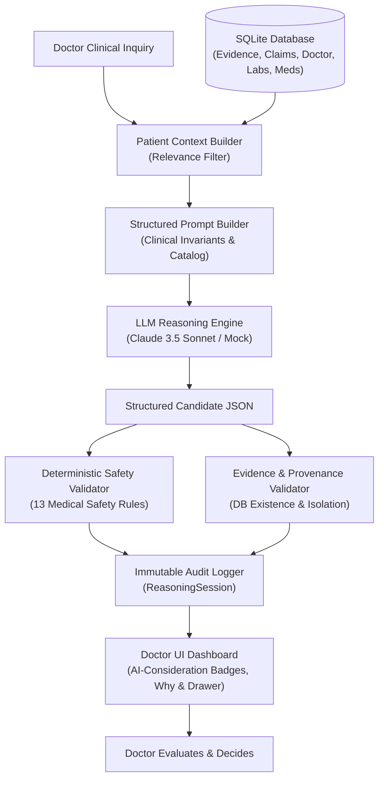

# EvoCare Phase 7 — Doctor-Only Clinical Reasoning Architecture

## 1. Overview & Core Philosophy

The **Doctor-Only Clinical Reasoning Assistant** provides evidence-grounded clinical decision support to clinicians analyzing complex longitudinal patient data.

### Core Principle
$$\textbf{LLM interprets} \longrightarrow \textbf{Rules constrain} \longrightarrow \textbf{Evidence proves} \longrightarrow \textbf{Memory provides context} \longrightarrow \textbf{Doctor decides}$$

The system is strictly:
- **NOT** an autonomous diagnosis generator.
- **NOT** a treatment or prescription recommender.
- **NOT** a general medical chatbot.
- **NOT** a patient-facing interface.

---

## 2. Architecture & Data Flow



---

## 3. Key Components

### 3.1 Patient Context Builder (`ClinicalContextService`)
Constructs a relevance-filtered context from:
1. **Demographics**: Patient Code, Age, Sex, Synthetic Flag.
2. **Clinician Diagnoses**: Doctor records with diagnosis and plan (`EV-DR-*`).
3. **Active Pharmacotherapy**: Drug name, dose, frequency, indication (`EV-MED-*`).
4. **Objective Laboratory History**: Panels, values, reference ranges (`EV-LAB-*`).
5. **Longitudinal Memory Claims & Baselines**: Active evolving claims with citations (`EV-CG-*`).
6. **Caregiver Observations**: Timestamped raw statements with severity and onset.
7. **Contextual Conflicts**: Recorded discrepancies between clinic and home settings.
8. **Known Unknowns**: Explicitly unconfirmed parameters (e.g., orthostatics, etiology=UNKNOWN).
9. **Verifiable Evidence Catalog**: Full immutable evidence mapping with hashes and timestamps.

### 3.2 Clinical Reasoning Safety Validator (`ClinicalReasoningValidator`)
Enforces 13 strict deterministic medical invariants:
1. **Default Status Rule**: Default status must be `POSSIBLE_CONSIDERATION` (never `DIAGNOSIS`).
2. **Prescription Refusal**: Rejection of starting/stopping/adjusting medications.
3. **Diagnosis Claim Rejection**: Ungrounded assertions of Dementia, Alzheimer's, Stroke, or confirmed Orthostatic Hypotension are rejected.
4. **Medication Causality**: Unproven claims that a medication is causing a symptom are rejected.
5. **Near-Fall Invariant**: Near-falls (`EV-CG-045`) cannot be converted into completed falls.
6. **Laboratory/Vital Integrity**: Fabricated vitals (e.g. BP 90/60) are rejected.
7. **Evidence Strength Calibration**: Isolated caregiver statements cannot claim `STRONG` evidence.
8. **Evidence Existence & Patient Isolation**: Every cited evidence ID must exist and belong to the target patient. Cross-patient evidence is rejected.
9. **Emergency Red Flag Assertion**: Red flags cannot falsely assert that the patient is currently having acute symptoms (e.g. chest pain).
10. **Zero Record Mutation**: Read-only station; no records, memories, or wiki pages are altered.

---

## 4. API Endpoints

### `POST /api/clinical-reasoning/{patient_id}`
- **Request Body**:
  ```json
  {
    "question": "Based on her recent dizziness and mobility changes, what possible problems should I consider?",
    "doctor_id": "DEMO_DOCTOR"
  }
  ```
- **Response**:
  ```json
  {
    "question": "Based on her recent dizziness and mobility changes, what possible problems should I consider?",
    "patient_id": "P001",
    "generated_at": "2026-09-10 12:00:00 UTC",
    "context_summary": { ... },
    "considerations": [
      {
        "title": "Postural / Orthostatic Instability Process",
        "category": "Hemodynamic / Postural",
        "description": "Episodic lightheadedness reported after standing up from bed.",
        "status": "POSSIBLE_CONSIDERATION",
        "supporting_evidence": [
          {
            "evidence_id": "EV-CG-041",
            "source_type": "CAREGIVER-REPORTED",
            "observed_at": "2026-09-03",
            "original_statement": "Patient felt dizzy after getting out of bed; resolved after sitting back down."
          }
        ],
        "contradicting_evidence": ["Dizziness etiology is explicitly UNKNOWN in clinical database."],
        "missing_information": ["Orthostatic vital signs (lying/standing BP and HR)"],
        "evidence_strength": "LIMITED",
        "reasoning": "Symptom onset upon getting out of bed suggests postural component.",
        "uncertainty": "Etiology is unconfirmed in database.",
        "references": ["EV-CG-041"]
      }
    ],
    "missing_information": ["Orthostatic blood pressure vitals", "Amlodipine administration timing"],
    "red_flags": ["Prompt clinical assessment is warranted if dizziness is accompanied by true syncope."],
    "relevant_changes": ["Recent episodic dizziness upon rising from bed (EV-CG-041)"],
    "limitations": ["Caregiver observations provide qualitative context."],
    "disclaimer": "AI-generated clinical reasoning support derived from recorded evidence. This tool does not establish a medical diagnosis or replace clinical judgment. The treating clinician remains the sole decision-maker.",
    "session_id": "RS-8F31E402",
    "validation_status": "PASSED"
  }
  ```

---

## 5. Security & Phase 8 Roadmap

Phase 7 operates under **DEMO DOCTOR MODE** with explicit warnings in the UI:
> `DOCTOR-ONLY CLINICAL REASONING | DEMO MODE — AUTHENTICATION NOT YET ENABLED (PHASE 8)`

Phase 8 will introduce:
- JWT Authentication & Doctor Role-Based Access Control (RBAC).
- Patient-level authorization policies.
- Cryptographic signature of reasoning sessions.
